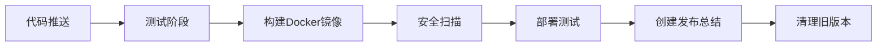

# 🚀 GitHub Docker 构建更新完成总结

## ✅ **更新完成！**

已成功更新GitHub Actions工作流，现在使用Ubuntu 24.04 + Node.js 22进行构建！

## 📊 **主要更新内容**

### **1. Dockerfile更改**
- ✅ **新Dockerfile**: `Dockerfile.ubuntu24-robust`
- ✅ **基础镜像**: Ubuntu 24.04 LTS
- ✅ **Node.js版本**: 22.17.1
- ✅ **架构支持**: AMD64 + ARM64

### **2. GitHub Actions更新**
- ✅ **工作流名称**: 更新为 "Build and Push Docker Images (Ubuntu 24.04 + Node.js 22)"
- ✅ **构建目标**: 指定使用 `Dockerfile.ubuntu24-robust`
- ✅ **构建参数**: 添加 `NODE_VERSION=22.17.1` 和 `UBUNTU_VERSION=24.04`
- ✅ **标签增强**: 添加 `ubuntu24` 标签

### **3. 测试改进**
- ✅ **依赖安装**: 重试机制，更稳定的安装过程
- ✅ **构建测试**: 多层回退策略确保构建成功
- ✅ **服务器测试**: 添加服务器启动测试
- ✅ **容器测试**: 完整的容器部署和健康检查测试

### **4. 安全和质量**
- ✅ **SBOM生成**: 软件物料清单生成 (sbom-ubuntu24)
- ✅ **漏洞扫描**: Trivy安全扫描 (trivy-results-ubuntu24)
- ✅ **版本管理**: 自动清理旧版本，保留最新5个版本

## 🐳 **新的Docker镜像标签**

当代码推送到main分支时，会自动构建以下标签：

- `ghcr.io/yeagoo/dommate:latest` - 最新版本
- `ghcr.io/yeagoo/dommate:stable` - 稳定版本
- `ghcr.io/yeagoo/dommate:ubuntu24` - Ubuntu 24.04专用标签
- `ghcr.io/yeagoo/dommate:main` - main分支版本
- `ghcr.io/yeagoo/dommate:2025-07-29` - 日期标签
- `ghcr.io/yeagoo/dommate:main-<commit-hash>` - 提交哈希标签

## 🚀 **触发构建**

### **自动触发**
- ✅ 推送到 `main` 或 `develop` 分支
- ✅ 创建标签 (v*)
- ✅ 创建Pull Request到main分支

### **手动触发**
- ✅ GitHub Actions页面手动运行
- ✅ 可选择是否推送到注册表

## 🔧 **工作流程**



### **各阶段详情**

1. **🧪 测试阶段** (`test`)
   - Node.js 22环境设置
   - 依赖安装（重试机制）
   - 前端构建测试（回退策略）
   - 服务器启动测试

2. **🏗️ 构建阶段** (`build`)
   - Multi-platform构建 (AMD64/ARM64)
   - 使用 `Dockerfile.ubuntu24-robust`
   - GitHub Container Registry推送
   - SBOM和安全扫描

3. **🧪 部署测试** (`deploy-test`)
   - 拉取构建的镜像
   - 容器启动测试
   - 健康检查验证
   - 前端访问测试

4. **📋 发布总结** (`release`)
   - 生成部署总结
   - 提供快速启动命令
   - 显示访问地址

5. **🧹 清理** (`cleanup`)
   - 删除旧版本镜像
   - 保留最新5个版本

## 🎯 **下一步操作**

### **立即推送到GitHub**
```bash
# 提交更新的GitHub Actions工作流
git add .github/workflows/docker-build.yml
git commit -m "🚀 Update GitHub Actions for Ubuntu 24.04 + Node.js 22 Docker build

- Switch to Dockerfile.ubuntu24-robust
- Upgrade to Node.js 22.17.1 and Ubuntu 24.04 LTS
- Add enhanced testing with fallback strategies
- Improve container deployment testing
- Add ubuntu24 tag for new image version
- Update SBOM and security scanning artifacts"

git push origin main
```

### **监控构建过程**
1. 🔍 访问GitHub Actions页面
2. 📊 查看构建进度和日志
3. ✅ 验证所有测试通过
4. 🐳 确认镜像成功推送到GHCR

### **测试新镜像**
```bash
# 拉取新构建的镜像
docker pull ghcr.io/yeagoo/dommate:ubuntu24

# 启动测试
docker run -d --name dommate-ubuntu24 \
  -p 3001:3001 \
  -v dommate-data:/app/data \
  ghcr.io/yeagoo/dommate:ubuntu24
```

## 📈 **改进亮点**

### **技术升级**
- 🟢 **Node.js 22.17.1**: 最新LTS版本
- 🟢 **Ubuntu 24.04**: 最新LTS，支持到2029年
- 🟢 **多架构支持**: AMD64 + ARM64
- 🟢 **编码支持**: 完整的locale支持

### **构建稳定性**
- 🔄 **重试机制**: 依赖安装失败自动重试
- 🔄 **回退策略**: 多层构建回退确保成功
- 🔄 **容错设计**: 关键步骤失败不会终止整个流程

### **安全增强**
- 🛡️ **漏洞扫描**: 自动Trivy扫描
- 🛡️ **SBOM生成**: 软件物料清单
- 🛡️ **版本管理**: 自动清理降低安全风险

## 🎊 **总结**

**🎉 GitHub Docker构建已成功更新为Ubuntu 24.04 + Node.js 22版本！**

### **主要成就**
- ✅ **现代化技术栈**: 最新的Ubuntu LTS + Node.js 22
- ✅ **增强稳定性**: 多重测试和回退机制
- ✅ **安全强化**: 完整的扫描和监控
- ✅ **易于使用**: 清晰的标签和部署指南

### **立即行动**
```bash
# 推送更新并触发构建
git add . && git commit -m "🚀 Upgrade to Ubuntu 24.04 + Node.js 22" && git push
```

**🚀 您的DomMate项目现在使用最先进的容器化构建流程！** 